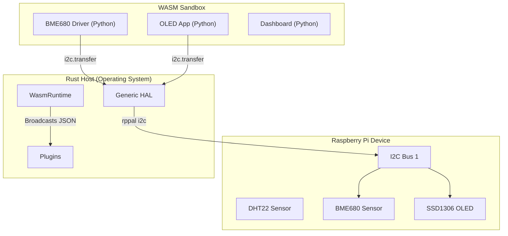

# WASI Python Host


A reference implementation demonstrating **Python WASM modules** reading **real sensor data** (DHT22, BME680) on a Raspberry Pi, using the **WASI Component Model** with a Rust host.

## The Key Demonstration

This project demonstrates a **"Compile Once, Run Anything"** architecture. 
The Rust Host acts as an **Operating System**, providing raw hardware access (I2C, SPI, GPIO), while Python plugins act as **Drivers** and **Apps**.

> 📘 **Deep Dive**: See [Generic HAL Architecture](docs/generic_hal_architecture.md).

### 🚀 New in Phase 4: Decoupled UI
- **Generic Dashboard**: The dashboard plugin now accepts `json_string` instead of typed args. Add new sensors **without touching Rust code**.
- **OLED Plugin**: A new generic I2C plugin that drives an SSD1306 display. It receives the same JSON data as the dashboard!

## 🏗️ System Architecture



### 1. The "Driver" (BME680 Plugin)
Does NOT rely on Host logic. It implements the driver in Python using raw bytes:
```python
# BME680 Plugin (Python)
# The host just passes bytes. It doesn't know it's a BME680!
i2c.transfer(0x77, "FA", 3)  # Read raw temp/pressure data
```

### 2. The "Broadcast" (Data Flow)
The Host collects readings from all sensors (Drivers), wraps them in JSON, and sends them to UI plugins:
```json
{
  "dht22": { "temp": 22.5, "humidity": 45.0 },
  "bme680": { "temp": 22.8, "iaq": 50 }
}
```

### 3. The "App" (OLED & Dashboard)
Plugins receive this JSON and render it. You can change the layout, add graphs, or change the OLED font **just by editing Python**.

## 🔌 Hardware Requirements

1.  **Raspberry Pi** (3, 4, 5, or Zero 2W)
2.  **DHT22 Sensor** (GPIO 4)
3.  **BME680 Sensor** (I2C 0x77)
4.  **SSD1306 OLED Display** (I2C 0x3C) *New!*

**Wiring (I2C):**
- SDA → GPIO 2 (Pin 3)
- SCL → GPIO 3 (Pin 5)
- VCC → 3.3V
- GND → GND

## 💡 Why This Architecture Matters

**1. Security Isolation**
A malicious or buggy plugin cannot crash the Host. It runs in a strict WASM sandbox with no network/file access unless explicitly granted.

**2. Resilience**
If the OLED plugin crashes, the Dashboard keeps running. If the BME680 driver errors, the Rust Host catches it and logs it.

**3. "Drop & Run" Extensibility**
Want to add a light sensor (BH1750)?
1. Write `bh1750.py` (Driver)
2. Drop `bh1750.wasm` into `plugins/`
3. Add to `host.toml`
4. **Done.** No Rust recompilation needed.

## Quick Start (On Raspberry Pi)

```bash
# 1. Build Plugins
./scripts/build-plugins.sh

# 2. Build Host
cd host
cargo run --release

# 3. View Dashboard
# http://raspberry-pi:3000
```

## License

MIT
