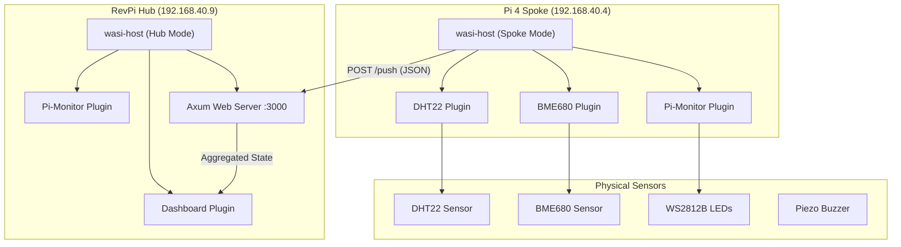

# WASI Python Host


A reference implementation demonstrating **Python WASM modules** reading **real sensor data** (DHT22, BME680) on Raspberry Pi devices, using the **WASI Component Model** with a Rust host. Supports **Hub/Spoke clustering** for multi-node deployments.

## The Key Demonstration

This project demonstrates a **"Compile Once, Run Anything"** architecture.
The Rust Host acts as an **Operating System**, providing hardware capabilities (I2C, GPIO, LEDs, Buzzer), while Python plugins act as **Drivers** and **Apps**.

> 📘 **Deep Dive**: See [Generic HAL Architecture](docs/generic_hal_architecture.md).

### 🚀 Current Features (v0.7.0)
- **Hub/Spoke Clustering**: RevPi Hub aggregates data from Pi 4 Spoke nodes
- **Generic Dashboard**: Accepts JSON data - add new sensors without touching Rust code
- **Real-time Sensor Polling**: DHT22, BME680, Pi System Stats
- **LED Status Indicators**: WS2812B strip controlled by Python plugins
- **Buzzer Alerts**: Web-triggered via `/api/buzzer`
- **OLED Display**: SSD1306 via generic I2C interface

## 🏗️ System Architecture



### Data Flow

1. **Spoke** polls sensors every 5 seconds via WASM plugins
2. **Spoke** sends readings to **Hub** via `POST /push` endpoint
3. **Hub** merges Spoke data with its own readings
4. **Dashboard** renders aggregated data from all nodes
5. **Browser** sees real-time data from the entire cluster

## 📁 Project Structure

```
wasi-python-host/
├── host/src/
│   ├── main.rs       # axum web server, polling loop, hub/spoke logic
│   ├── runtime.rs    # wasm component loading, capability implementations
│   ├── config.rs     # toml configuration loader
│   ├── gpio.rs       # hardware abstraction (i2c, leds, buzzer)
│   └── domain.rs     # shared types (AppState, SensorReading)
├── plugins/
│   ├── dht22/        # temperature/humidity sensor driver
│   ├── bme680/       # environmental sensor with IAQ
│   ├── pi-monitor/   # cpu/ram/uptime monitoring
│   ├── dashboard/    # html dashboard renderer
│   └── oled/         # ssd1306 display driver
├── wit/
│   └── plugin.wit    # wasm interface definitions (the "constitution")
├── config/
│   ├── hub.toml      # configuration for hub nodes
│   └── spoke.toml    # configuration for spoke nodes
└── scripts/
    ├── build-plugins.sh    # compile python to wasm
    └── install-service.sh  # systemd service installer
```

## 🔌 Hardware Requirements

### Hub (RevPi Connect 4)
- No sensors required (aggregates data from spokes)
- Runs dashboard web server
- Monitors its own CPU/RAM stats

### Spoke (Raspberry Pi 4)
- **DHT22 Sensor** (GPIO 4)
- **BME680 Sensor** (I2C 0x77)
- **WS2812B LED Strip** (GPIO 18) - 11 LEDs
- **Piezo Buzzer** (GPIO 17 via relay)

## 🚀 Deployment

### Quick Start (Spoke Node)

```bash
# 1. Clone and build plugins
git clone <repo>
cd wasi-python-host
./scripts/build-plugins.sh

# 2. Build the Rust host
cd host
cargo build --release

# 3. Copy spoke config
cp ../config/spoke.toml ../config/host.toml
# Edit host.toml to set your hub_url

# 4. Install as systemd service
cd ..
sudo ./scripts/install-service.sh

# 5. View dashboard on Hub
# http://192.168.40.9:3000
```

### Configuration

**Spoke (`config/spoke.toml`)**:
```toml
[cluster]
role = "spoke"
hub_url = "http://192.168.40.9:3000/push"
node_id = "pi4-node-1"

[plugins.dashboard]
enabled = false  # Spokes don't need dashboard
```

**Hub (`config/hub.toml`)**:
```toml
[cluster]
role = "hub"
hub_url = ""
node_id = "revpi-hub"

[plugins.dht22]
enabled = false  # Hub has no sensors (aggregator only)
```

## 💡 Why This Architecture Matters

**1. Security Isolation**
A malicious or buggy plugin cannot crash the Host. It runs in a strict WASM sandbox with no network/file access unless explicitly granted.

**2. Resilience**
If one plugin crashes, others keep running. The Rust Host catches errors and logs them.

**3. "Drop & Run" Extensibility**
Add new sensors by writing Python + dropping `.wasm` files. No Rust recompilation.

**4. Distributed Monitoring**
Hub/Spoke architecture allows monitoring multiple locations from a single dashboard.

## 📚 Documentation

- [Architecture Guide](docs/generic_hal_architecture.md) - Complete system architecture, Hub/Spoke, and roadmap

## License

MIT
