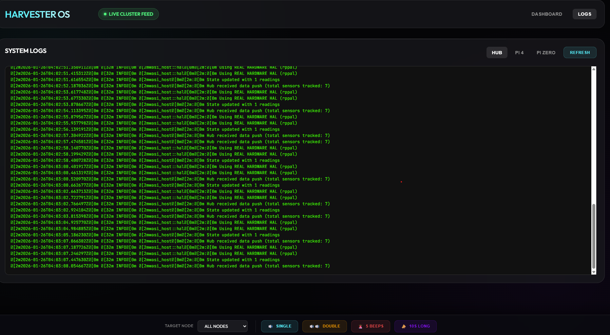
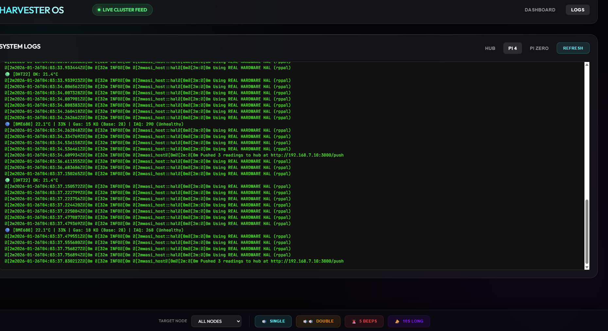
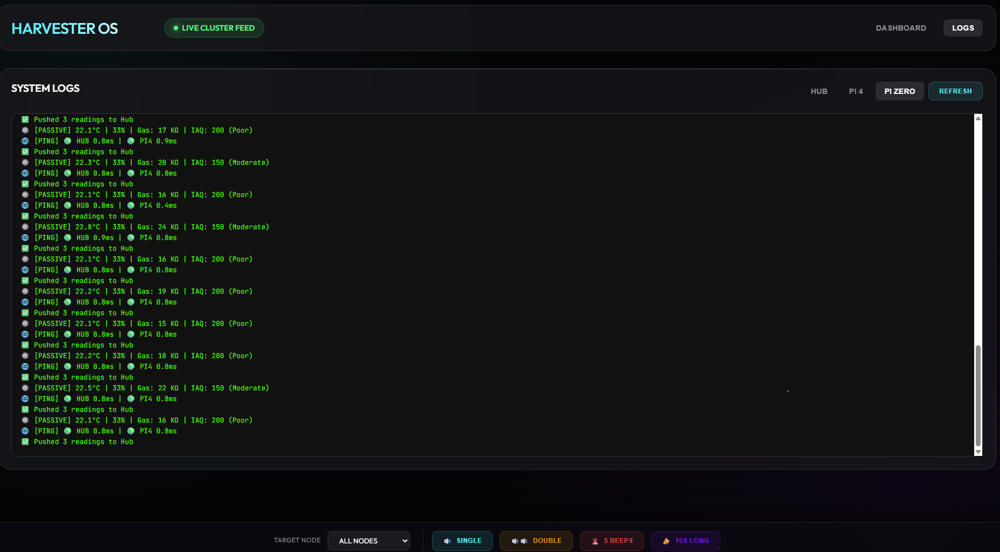

# HARVESTER OS


A **multi-node edge computing platform** using WASI Component Model for secure, sandboxed Python plugins on Raspberry Pi hardware.

## 📸 Screenshots & Demos

### Dashboard with Multi-Node Logs

| Hub Logs | Pi4 Logs | PiZero Logs |
|----------|----------|-------------|
|  |  |  |

### 🎥 Live Demos

#### Dashboard Hot Swap
[](https://streamable.com/klbojw)

#### Sensor Hot Swap
[](https://streamable.com/cd3050)

> **Key Takeaway**: The Rust host acts as a stable "Operating System", while Python plugins provide flexible, hot-reloadable "User Space" logic.

## Architecture Overview

```
                    ┌─────────────────────────────────────────┐
                    │           HARVESTER OS                   │
                    │         Web Dashboard (:3000)            │
                    └────────────────┬────────────────────────┘
                                     │
         ┌───────────────────────────┼───────────────────────────┐
         │                           │                           │
   ┌─────┴─────┐              ┌──────┴──────┐            ┌──────┴──────┐
   │  REVPI    │              │   PI4       │            │  PIZERO     │
   │  HUB      │◄────────────►│  SPOKE 1    │◄──────────►│  SPOKE 2    │
   │ 192.168.7.10            │ 192.168.7.11 │           │ 192.168.7.12 │
   └─────┬─────┘              └──────┬──────┘            └──────┬──────┘
         │                           │                           │
   ┌─────┴─────┐              ┌──────┴──────┐            ┌──────┴──────┐
   │ Plugins:  │              │ Plugins:    │            │ Native Svc  │
   │ - dashboard             │ - dht22     │            │  (Python)   │
   │ - revpi-monitor         │ - bme680    │            │             │
   └───────────┘              │ - pi4-monitor           └─────────────┘
                              │ - oled      │
                              └─────────────┘
```

### Node Roles

| Node | IP | Role | Sensors/Hardware |
|------|-----|------|------------------|
| RevPi Connect 4 | 192.168.7.10 | Hub | Dashboard, system monitoring |
| Raspberry Pi 4 | 192.168.7.11 | Spoke | DHT22, BME680, WS2812B LEDs, Buzzer |
| Raspberry Pi Zero 2W | 192.168.7.12 | Spoke | Lightweight native service |

## Plugins

All plugins use the **Generic HAL Architecture** - Python WASM code that runs identically across nodes.

| Plugin | WIT World | Description |
|--------|-----------|-------------|
| `dht22` | dht22-plugin | Temperature/humidity via `gpio_provider.read_dht22()` |
| `bme680` | bme680-plugin | Environmental sensor via raw `i2c.transfer()` |
| `dashboard` | dashboard-plugin | Multi-node web UI with log viewer |
| `pi4-monitor` | pi4-monitor-plugin | Pi 4 system health (CPU, RAM, uptime) |
| `revpi-monitor` | revpi-monitor-plugin | RevPi Hub monitoring |
| `pizero-monitor` | - | Lightweight Pi Zero monitoring |
| `oled` | oled-plugin | SSD1306 display driver |

## Key Features

### 1. Secure Sandboxing
Python plugins run in WASM sandboxes. They **cannot** access files, network, or hardware unless explicitly granted via WIT interfaces.

### 2. Generic HAL (Hardware Abstraction Layer)
BME680 uses raw I2C transfers (`i2c.transfer()`), not sensor-specific host functions. This means:
- **Compile Once, Run Anywhere**: Same WASM works on any node
- **No Host Recompilation**: Add new I2C sensors without Rust changes

### 3. Hot Reload
Update plugin Python code → rebuild WASM → host auto-reloads without restart.

### 4. Multi-Node Dashboard
Single dashboard shows:
- DHT22 & BME680 sensor data
- All three node health stats
- Log viewer with tabs for HUB/PI4/PIZERO
- Buzzer controls

## Quick Start

### Prerequisites
- Rust toolchain
- Python 3.11+ with `componentize-py`
- Configured `.env` file with node IPs

### Build & Deploy

```bash
# Build plugins to WASM
./scripts/build-plugins-wsl.sh

# Deploy to all nodes
./scripts/update-all-nodes.sh

# Or deploy just plugins
./scripts/update-plugins.sh
```

### Run Host

```bash
cd host
cargo run --release --config config/spoke.toml
```

Dashboard available at `http://192.168.7.10:3000`

## WIT Interface (API Contract)

```wit
package demo:plugin@0.2.0;

// Generic I2C for any sensor
interface i2c {
    transfer: func(addr: u8, write-data: string, read-len: u32) -> result<string, string>;
}

// GPIO operations
interface gpio-provider {
    read-dht22: func(pin: u8) -> result<tuple<f32, f32>, string>;
    get-timestamp-ms: func() -> u64;
    get-cpu-temp: func() -> f32;
}

// System metrics
interface system-info {
    get-memory-usage: func() -> tuple<u32, u32>;
    get-cpu-usage: func() -> f32;
    get-uptime: func() -> u64;
}
```

## Project Structure

```
├── host/                 # Rust WASM host
│   └── src/
│       ├── main.rs       # Entry point, HTTP server
│       ├── runtime.rs    # WASM loading, WIT bindings
│       ├── gpio.rs       # Hardware access
│       ├── hal.rs        # I2C/SPI/UART HAL
│       └── config.rs     # Node configuration
├── plugins/
│   ├── bme680/           # Environmental sensor (I2C)
│   ├── dht22/            # Temp/humidity (GPIO)
│   ├── dashboard/        # Web UI
│   ├── pi4-monitor/      # Pi4 health
│   ├── revpi-monitor/    # RevPi health
│   ├── pizero-monitor/   # PiZero health
│   └── oled/             # Display driver
├── wit/
│   └── plugin.wit        # API contract
├── config/
│   ├── hub.toml          # RevPi config
│   ├── spoke.toml        # Pi4 config
│   └── pizero.toml       # PiZero config
├── pizero-native/        # Native Python for PiZero
├── scripts/              # Deployment scripts
└── docs/                 # Architecture documentation
```

## License

MIT
