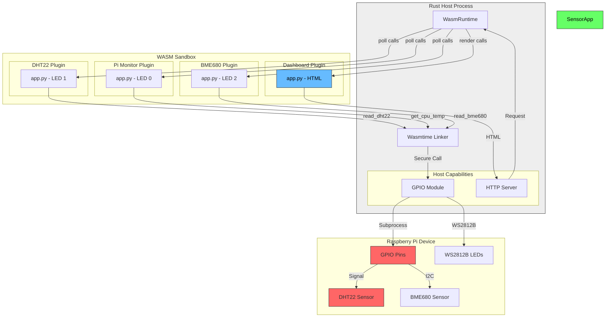

# WASI Python Host


A reference implementation demonstrating **Python WASM modules** reading **real sensor data** (DHT22, BME680) on a Raspberry Pi, using the **WASI Component Model** with a Rust host.

## The Key Demonstration

This project shows the **WASI capability model** in action.
> 📘 **Deep Dive**: See [Architecture Deep Dive](docs/advanced_architecture.md) for details on State Persistence, Hysteresis, and the Component Model.

```
┌──────────────────────────────────────────────────────────────┐
│                    Rust Host (Wasmtime)                       │
│                                                              │
│   ┌──────────────────────────────────────────────────────┐   │
│   │  Host Capabilities (Rust Implements)                 │   │
│   │  • gpio-provider:                                    │   │
│   │      read_dht22(pin) → (temp, humidity)             │   │
│   │      read_bme680(addr) → (temp, hum, pres, gas)     │   │
│   │      get_cpu_temp() → celsius                        │   │
│   │      get_timestamp_ms() → unix timestamp             │   │
│   │  • led-controller:                                   │   │
│   │      set_led / set_two / sync_leds (buffered)       │   │
│   │  • buzzer-controller:                                │   │
│   │      buzz(duration_ms) / beep(count, dur, interval) │   │
│   └────────────────────────┬─────────────────────────────┘   │
│                            │                                  │
│   ┌────────────────────────┼─────────────────────────────┐   │
│   │  Wasmtime Sandbox      │                             │   │
│   │         ┌──────────────┴──────────────┐              │   │
│   │         │ Python WASM Plugin          │              │   │
│   │         │  • imports capabilities     │              │   │
│   │         │  • contains ALERT LOGIC     │              │   │
│   │         │  • hot-swappable!           │              │   │
│   │         └─────────────────────────────┘              │   │
│   └──────────────────────────────────────────────────────┘   │
└──────────────────────────────────────────────────────────────┘
                            ↓
    ┌───────────────┐  ┌───────────────┐  ┌───────────────┐  ┌───────────────┐
    │  DHT22 Sensor │  │  BME680 Sensor│  │  LED Strip    │  │  Buzzer       │
    │  (GPIO 4)     │  │  (I2C 0x77)   │  │  (GPIO 18)    │  │  (GPIO 17)    │
    └───────────────┘  └───────────────┘  └───────────────┘  └───────────────┘
```

**The sandboxed Python WASM plugin CANNOT directly access GPIO.**  
It must call host capabilities which control access.  
This is the "landlord/tenant" security model that makes WASI powerful.

## 🎬 Showcase & Demo

This project demonstrates **Secure Hot-Swapping** on embedded hardware.

### 🏗️ System Architecture (Mermaid)
The following diagram illustrates how the Rust Host securely manages the Python plugins and hardware access:



### 🎥 Live Demos
We have captured the following capabilities in action:

#### 1. Dashboard Hot Swap (Terminal/CRT Theme)
[](https://streamable.com/klbojw)

#### 2. Manual Controls (Buzzer & CPU Temp)
Dashboard includes **CPU Temp** and **Buzzer buttons** (Beep/Long Beep) to show bi-directional control.

#### 3. Sensor Hot Swap (Logic Update)
[](https://streamable.com/cd3050)

> **Key Takeaway**: The Rust host acts as a stable "Operating System", dealing with GPIO and networking, while the Python guests provide flexible, hot-reloadable "User Space" logic.

## 🎨 User Experience Features (V2 Update)

The dashboard demonstrates modern web UX patterns with a **Cyberpunk / Terminal Aesthetic**:

- **System Health Monitor**: New card displaying Pi CPU Temp, RAM Usage, and Uptime (via `sysinfo` crate)
- **Cyberpunk Theme**: VT323 font, green-on-black terminal styling, scanline effects
- **Responsive Grid**: Flex-wrap layout that adapts from Desktop to Mobile seamlessly
- **Live Updates**: Browser polls `/api` endpoint every 2 seconds via JavaScript `fetch()`
- **Responsive Design**: Mobile-friendly layout with CSS Grid

**API Endpoint:**
```bash
curl http://raspberry-pi:3000/api
```

**Response:**
```json
{
  "readings": [
    {
      "sensor_id": "dht22-gpio-4",
      "temperature": 21.5,
      "humidity": 40.9,
      "timestamp_ms": 1737073200000
    },
    {
      "sensor_id": "bme680-i2c-0x77",
      "temperature": 22.1,
      "humidity": 38.5,
      "pressure": 1013.2,
      "gas_resistance": 150.5,
      "iaq_score": 35,
      "timestamp_ms": 1737073200000
    }
  ],
  "last_update": 1737073200000
}
```

This `/api` endpoint enables:
- Programmatic access to sensor data
- Third-party integrations (Home Assistant, Grafana, etc.)
- Custom dashboards and mobile apps

## 🔌 Hardware Requirements

To run this demo, you need:
1.  **Raspberry Pi** (3, 4, or 5)
2.  **DHT22 Temperature/Humidity Sensor**
3.  **BME680 Environmental Sensor (I2C)**
4.  **Wiring**:
    *   **VCC (+) [Pin 1]** → 3.3V (Physical Pin 1)
    *   **Data [Pin 2]** → **GPIO 4 (Physical Pin 7)**
    *   **GND (-) [Pin 4]** → Ground (Physical Pin 6)
    *   *Note: Most modules have a built-in pull-up resistor. If using a raw sensor, add a 4.7kΩ resistor between VCC and Data.*
    
    **BME680 (I2C)**:
    *   **VCC** → 3.3V
    *   **GND** → Ground
    *   **SDA** → GPIO 2 (Pin 3)
    *   **SCL** → GPIO 3 (Pin 5)

> **Configuration**: GPIO pins, poll intervals, and **active plugins** are set in `config/host.toml`. You can enable/disable plugins at runtime without recompiling!


## 💡 Why This Architecture Matters

**Is this overengineering? No.**

If your *only* goal is to read a sensor, a 5-line Python script is better. But this project demonstrates an architecture for **Secure, Multi-Tenant Edge Computing**.

**Why use this architecture?**
1.  **Security Isolation**: The Python code runs in a sandbox. It cannot access files or network unless you explicitly grant that capability in `plugin.wit`.
2.  **Resilience**: If the Python plugin returns an error, the Rust host logs it and continues. The system doesn't crash.
3.  **Hot Swapping**: You can update the business logic (Python) by rebuilding the WASM file. The host detects the change and reloads automatically.
4.  **Configuration-Driven**: Runtime settings (poll interval, GPIO pins) are in `config/host.toml`, not hardcoded.

## 🏗️ Migration Strategy (How to use this as a model)

**"I have a massive Python legacy codebase. How do I use this?"**

Don't rewrite everything at once. Use the **Strangler Fig Pattern**:

1.  **Identify the Core**: Find the one piece of logic you change most often (e.g., "Business Logic" or "Data Formatting").
2.  **Move just THAT to WASM**: Keep your hardware drivers in Python on the host (or migrate them to Rust later), but run the changing logic in a sandbox.
3.  **Define the Interface**: Write a `.wit` file that describes what that one piece of logic needs (inputs/outputs).
4.  **Swap it out**: Replace the Python function call with a call to the WASM module.

**Why is this better?**
*   Legacy code runs as usual.
*   New/Risky code runs in a sandbox.
*   If the new code crashes, it's caught by the host. It doesn't crash the whole robot/server.

| Feature | Raw Python Script | This WASI Host |
| :--- | :--- | :--- |
| **Simplicity** | High (Easy) | Medium (Requires Build) |
| **Security** | None (Full Access) | **Sandboxed (Capability Model)** |
| **Isolation** | Process Level | **WASM Level (Micro-VM)** |
| **Hot Reload** | Restart Process | **Instant (No Restart)** |
| **Stability** | Crash = Downtime | **Crash = Log Error & Retry** |

## Quick Start (On Raspberry Pi)

### Prerequisites

- Raspberry Pi with DHT22 sensor on GPIO pin 4
- Rust toolchain installed (`curl --proto '=https' --tlsv1.2 -sSf https://sh.rustup.rs | sh`)
- Python 3.11+ with adafruit_dht (`pip3 install adafruit-circuitpython-dht`)
- componentize-py (`pip3 install componentize-py`)

### Build & Run

```bash
# 1. Build Python plugins to WASM (uses scripts/build-plugins.sh)
bash scripts/build-plugins.sh

# 2. Build and run the Rust host
cd host
cargo run --release

# 3. Open http://raspberry-pi-ip:3000 in browser
```

You'll see **real temperature and humidity** from your DHT22 sensor!

## 📜 The WIT "Constitution"

The `wit/plugin.wit` file is the most important file in this project. It is not just code; it is the **Security Contract**.

```wit
// The HOST provides this to the sandboxed WASM plugin
interface gpio-provider {
    read-dht22: func(pin: u8) -> result<tuple<f32, f32>, string>;
    get-timestamp-ms: func() -> u64;
}

// The PLUGIN implements this, host calls it
interface dht22-logic {
    poll: func() -> list<dht22-reading>;
}
interface pi-monitor-logic {
    poll: func() -> pi-stats;
}

```

**Why highlight this?**
*   **Deny by Default**: If a function isn't in this file, the Python guest *literally cannot call it*. There is no `import os`, no `subprocess`, no network.
*   **Type Safety**: The host guarantees it triggers `poll()`, and the guest guarantees it returns a `list<sensor-reading>`. No JSON parsing errors at runtime.

## How It Works

### 1. Python Calls the Host Capability

```python
# app.py (runs in WASM sandbox)
from wit_world import Dht22Logic
from wit_world.imports import gpio_provider
from wit_world.types import Dht22Reading

class Dht22Logic(Dht22Logic):
    def poll(self) -> list[Dht22Reading]:
        # This calls the RUST HOST which reads the actual hardware
        temperature, humidity = gpio_provider.read_dht22(4)
        
        return [Dht22Reading(
            sensor_id="dht22-gpio4",
            temperature=temperature,
            humidity=humidity,
            timestamp_ms=gpio_provider.get_timestamp_ms(),
        )]
```

### 2. Rust Implements the Capability

```rust
// The host provides this implementation
impl gpio_provider::Host for HostState {
    async fn read_dht22(&mut self, pin: u8) -> Result<(f32, f32), String> {
        // Offloaded to blocking thread for responsiveness AND reliability
        tokio::task::spawn_blocking(move || {
            gpio::read_dht22(pin)
        }).await ...
    }
}
```

This architecture is inspired by patterns used in production systems like:

| Project | Use Case |
|---------|----------|
| **Fermyon Spin** | Serverless functions with capability-based security |
| **wasmCloud** | Distributed IoT/edge actors with sandboxed plugins |
| **Shopify Functions** | Sandboxed merchant logic |

## Hot Reload Demo

Edit the Python plugin, rebuild WASM, and see changes without restarting the host:

```bash
# Terminal 1: Run host
cd host && cargo run --release

# Terminal 2: Edit and rebuild
vim ../plugins/sensor/app.py  # Make changes
componentize-py -d ../../wit -w dht22-plugin componentize app -o dht22.wasm

# The host detects the change and reloads automatically!
```

## License

MIT
