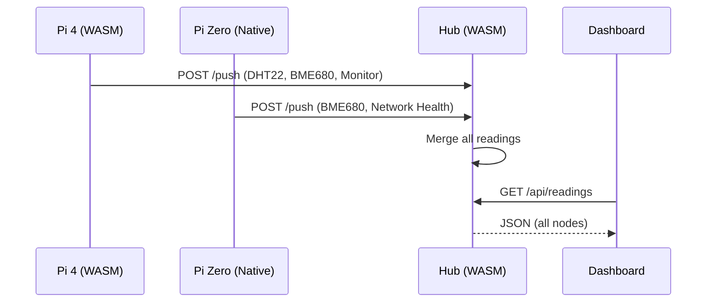

# 🏗️ WASI Sensor System - Deep Dive Architecture (Hybrid Edition)

**Version:** 2.2.0 (Hybrid Architecture)
**Date:** Jan 25, 2026

---

## 1. 🌌 High-Level Architecture
The system has evolved into a **Hybrid Hub-and-Spoke** harvester. It uses WASM for nodes with sufficient RAM, and native Python for memory-constrained devices.

### 📍 Topology
*   **Hub (RevPi Connect 4)**:
    *   **IP**: `192.168.7.10`
    *   **Runtime**: WASM (Wasmtime + Python plugins)
    *   **Role**: Aggregates data from all Spokes, hosts dashboard
*   **Pi 4 Spoke**:
    *   **IP**: `192.168.7.11`
    *   **Runtime**: WASM
    *   **Role**: Reads DHT22, BME680; controls LEDs/Buzzer
*   **Pi Zero**:
    *   **IP**: `192.168.7.12`
    *   **Runtime**: Native Python (pizero_service.py)
    *   **Role**: Reads BME680 via smbus2, monitors network health
    *   **Why Native?**: 512MB RAM too small for WASM runtime (~300MB)

---

## 2. 🔌 The Host: Rust & WASI (`host/src/`)
The Rust host is the secure execution environment for sandboxed WASM plugins.

### ⚙️ Core Components:
1.  **The Runtime (`runtime.rs`)**:
    *   Uses Wasmtime for WASM execution
    *   Grants host functions (GPIO, I2C, LEDs) to plugins
    *   Supports hot-reload of .wasm files

2.  **The HAL (`hal.rs`)**:
    *   Unified LED buffer (11 pixels)
    *   Mock vs Real mode (compile-time feature)
    *   I2C via rppal or i2cdev

3.  **The API Gateway (`main.rs`)**:
    *   `/push` - Receives sensor data from Spokes
    *   `/api/readings` - Returns aggregated JSON for dashboard
    *   `/api/buzzer/control` - Proxies buzzer commands to Spokes

---

## 3. 🐍 Pi Zero Native Service (`pizero-native/`)

### Why Native?
| Component | WASM | Native |
|-----------|------|--------|
| Runtime overhead | ~250MB | ~10MB |
| BME680 plugin | ~50MB | ~20MB |
| **Total** | **~300MB** | **~30MB** |

### Service Features
```python
# pizero_service.py
- BME680 via smbus2 (direct I2C)
- CPU temperature from /sys/class/thermal
- Memory from /proc/meminfo
- Network health (ping Hub + Pi4)
- POST /push every 5 seconds
```

### Systemd Service
```ini
[Service]
ExecStart=/usr/bin/python3 /home/pi/wasi-python-host/pizero-native/pizero_service.py
Restart=always
```

---

## 4. 🧩 The Plugins: WASM (Hub + Pi4)

| Plugin | Role | LED |
|--------|------|-----|
| `dht22` | Temperature/Humidity | 1 |
| `bme680` | Air Quality (IAQ) | 2 |
| `pi4-monitor` | Spoke CPU/RAM | 3 |
| `revpi-monitor` | Hub CPU/RAM | 3 |
| `dashboard` | HTML Renderer | - |

### 🔔 Alert Logic
Thresholds are defined in Python plugins and hot-swappable:
- Room temp > 30°C → LED 1 RED + buzzer
- CPU temp > 75°C → LED 3 RED + beeps
- IAQ > 200 → LED 2 RED + alert

---

## 5. 💫 Data Flow



---

## 6. 📊 Dashboard Features

The WASM dashboard plugin displays:
- **Per-Node Cards** with role badge (Hub/Spoke)
- **CPU Temp** (color-coded: cool/warm/hot)
- **CPU Load** percentage
- **Memory** (used/total MB + percentage)
- **DHT22** temperature and humidity
- **BME680** air quality with IAQ score
- **Network Health** from Pi Zero (🟢/🔴)

---

## 7. 🔍 Reliability & Recovery

1.  **Network Loss**: Spokes continue local operation; data pushing errors gracefully
2.  **Plugin Crash**: WASM isolates failures; other plugins continue
3.  **Memory Exhaustion**: Pi Zero uses native Python to avoid OOM
4.  **Shared I2C**: Pi4 and Pi Zero both read BME680 via Wago lever nuts

---

## 8. 📝 Deployment Scripts

| Script | Nodes | Purpose |
|--------|-------|---------|
| `update-all-nodes.sh` | All | Full cluster update |
| `update-plugins.sh` | Hub, Pi4 | WASM plugins only |
| `update-host.sh` | Hub, Pi4 | Rust binary only |
| `deploy-pizero-native.sh` | Pi Zero | Native service only |

---

## 9. 🗺️ Roadmap

### Completed ✅
- [x] Hybrid WASM/Native architecture
- [x] Pi Zero native service with BME680
- [x] Network health monitoring
- [x] Memory stats on dashboard

### Future ⏳
- [ ] Permission system for I2C addresses
- [ ] Raft consensus for distributed state
- [ ] Dynamic plugin discovery